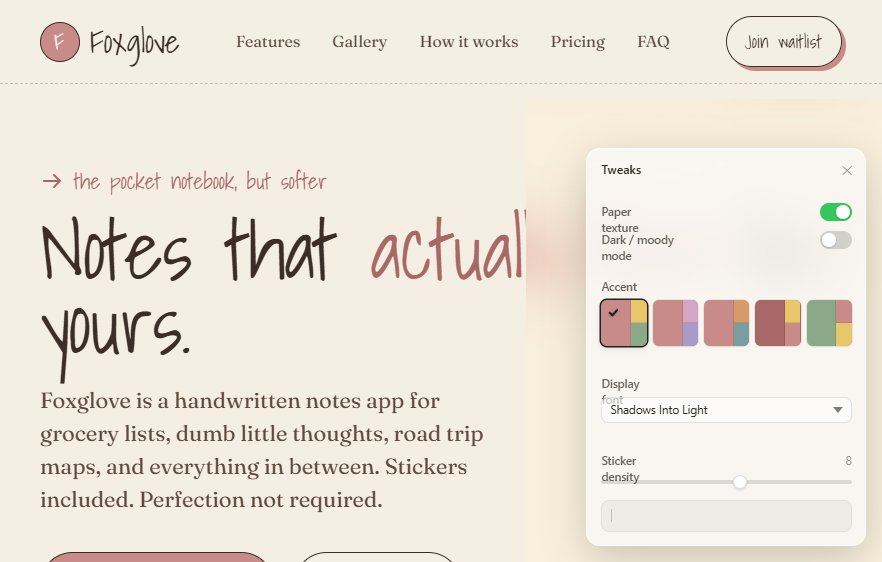

# ? Foxglove — The Cozy Handwritten Notes Landing Page

> Notes that actually feel like yours. Handwritten notes app for grocery lists, dumb little thoughts, road trip maps, and everything in between. Stickers included. Perfection not required.



## ? Features
- **Pencil-first & Tactile Aesthetic**: Soft paper texture, cozy analog vibe with custom typography and warm color palettes.
- **Interactive Draggable Stickers**: Drag-and-drop doodle stickers (hearts, stars, flowers, clouds, coffee mugs, fox tags) with physics-inspired release wobble.
- **Shoebox of Little Moments**: Clickable flipping polaroid cards revealing handwritten notes and memories.
- **Community Wall**: Gallery of community pages with responsive grid layout.
- **Live Tweaks & Customizer Panel**: Switch between Cozy and Moody Dark theme, toggle paper texture overlay, adjust sticker density, modify accent colors, and scale typography in real-time.
- **Interactive Waitlist Onboarding**: Dynamic signup form with live number generation animation.
- **Expandable FAQ Accordion & Pricing Grid**.

## ??? Built With
- **HTML5 & CSS3** (Custom properties, responsive CSS grid, flexbox, keyframe animations)
- **React 18 & Babel Standalone**
- **Google Fonts**: Shadows Into Light, Caveat, Fraunces, IBM Plex Mono

## ?? How to Run Locally
Simply open `index.html` or `Foxglove.html` in any modern web browser or serve via a lightweight HTTP server:

```bash
# Using Python
python -m http.server 3000

# Using Node.js npx serve
npx serve .
```
